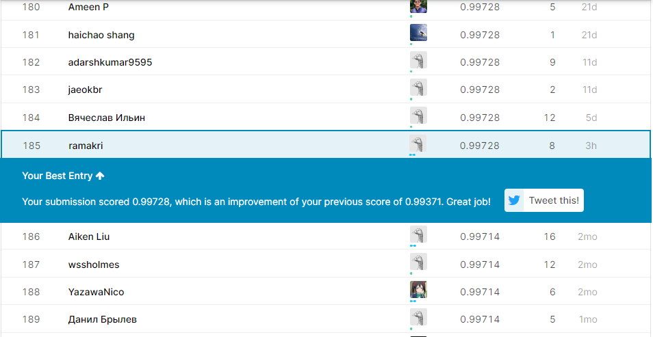

# Digit Recognizer: Learn computer vision fundamentals with the famous MNIST data
### Data Source 
Data can be either dowloaded from my <a href = "https://github.com/ramakrishnan-21/MNIST-dataset">GitHub profile</a> or directly download from <a href = "https://www.kaggle.com/c/digit-recognizer/data">kaggle</a>
### Description
MNIST ("Modified National Institute of Standards and Technology") is the de facto “hello world” dataset of computer vision. Since its release in 1999, this classic dataset of handwritten images has served as the basis for benchmarking classification algorithms. As new machine learning techniques emerge, MNIST remains a reliable resource for researchers and learners alike.

In this competition, your goal is to correctly identify digits from a dataset of tens of thousands of handwritten images. We’ve curated a set of tutorial-style kernels which cover everything from regression to neural networks. We encourage you to experiment with different algorithms to learn first-hand what works well and how techniques compare.

In this article my solution goes through the following steps
- Defining the problem statement
- collecting the data
- preprocessing
- cnn
- ensembling predictions
## Prerequisites
You need to have installed following softwares and libraries in your machine before running this project.
* Python 3
* Anaconda: It will install ipython notebook and most of the libraries which are needed like sklearn, pandas, seaborn, matplotlib, numpy, scipy.
## Installing
* Python 3: https://www.python.org/downloads/
* Anaconda: https://www.anaconda.com/download/
 
 

## Performance

 I recently achieved an accuracy score of 0.99728 on the public leaderboard.  I am ranked among the top 6% of all teams that are currently competing.

 
 
 ## Important Note
 This model will take a lot of time to train. Pre-trained model can be downloaded from <a href = "https://github.com/ramakrishnan-21/MNIST-dataset/tree/master/Pre-Trained-Model">here</a>.You can refer the notebook if you have any difficulites in loading the pre-trained model
 ## Authors
 Ramakrishnan - Complete Work

